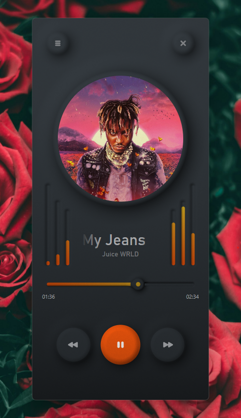

# DarkPlayer
A neumorphic music player for Windows 10 / 11.

Based on concepts by [Filip Legierski](https://dribbble.com/kedavra).

  

## Building:
1. Open solution in Visual Studio 2022
2. Build

## Q & A:
**Q: Why does the code look like cancer?**

**A:** Because it is.

**Q: Why not just use the default windows media player?**

**A:** I didn't really know how good the Win11 media player was when I started making this. I was trying to replace the garish light-themed legacy Win10 media player that was burning my eyes out. But hey at least mine has a visualizer, which both media players lack.